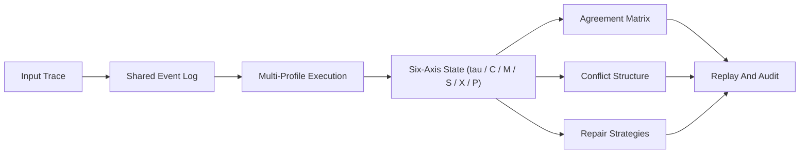

# Fellowship Comparative Evaluation v0.1

## Step 2. Baseline Contrast

The most important comparative result is not that the full system detects more raw violations. All three modes detect the same `26 / 26` raw violation and repair signals across the current comparative suites.

What changes is whether those signals can be aligned into measurable cross-system structure.

| Mode | Cases | Profile Runs | Raw Violation Signal Cases | Raw Repair Signal Cases | Agreement Pairs Observed | Conflict-Observable Cases | Shared-Axis Cases | Profile-Specific Repair Cases | Cross-Profile Replay |
| --- | ---: | ---: | ---: | ---: | ---: | ---: | ---: | ---: | --- |
| Single Profile Only | 26 | 26 | 26 | 26 | 0 | 0 | 0 | 0 | no |
| Profiles In Silos | 26 | 104 | 26 | 26 | 0 | 0 | 0 | 0 | no |
| Full Comparative Layer | 26 | 104 | 26 | 26 | 18 | 26 | 24 | 26 | yes |

Interpretation:

- `single_profile_only` can replay one profile's judgment, but it cannot expose disagreement because no second judgment exists.
- `profile_silo` runs all four profiles, but it still cannot expose comparative structure because the outputs are not aligned into one shared report.
- `full_comparative_layer` does not merely execute more profiles. It makes disagreement, shared violation axes, and profile-specific repair actions observable and replayable.

This directly answers the baseline question:

> Without the comparative layer, the system can still detect that something is wrong, but it cannot quantify who disagrees, where they disagree, or how repairs differ by ethical profile.

## Step 1. Core Claim

> We show that heterogeneous ethical systems can be executed, audited, replayed, and compared under a shared event-log protocol, with measurable agreement, conflict, and repair structures.

Why this claim is now defensible:

- the same `DialogueEvent` trace is executed under `Omega Public Reasoning`, `Kantian`, `Utilitarian`, and `Care Ethics`
- the system emits `agreement_matrix`, `profile_conflict_count`, `shared_violation_axes`, and `profile_specific_repair_actions`
- the same event-log protocol also supports cross-cultural and multi-agent traces rather than only static single-profile benchmark cases

## Step 3. Shared-Protocol Figure



Operational reading:

- `Input Trace` can be a benchmark case, a cultural scenario, a multi-agent conversation, or a runtime trace with vLLM metadata.
- `Shared Event Log` keeps all profiles attached to the same observed sequence.
- `Multi-Profile Execution` creates comparable judgments instead of isolated outputs.
- `Six-Axis State` gives each judgment a common telemetry basis.
- `Agreement / Conflict / Repair` turn ethical divergence into a structured audit object.
- `Replay And Audit` lets the same divergence be inspected later without rerunning an opaque online interaction.

## Step 4. Cyber Extension

The next deployment-facing move is to attach this comparative audit layer to cyber anomaly traces rather than only ethics benchmark cases.

Target path:

```text
cyber behavior -> event log -> multi-profile execution -> ethics conflict -> repair / escalation
```

Concrete mapping:

| Cyber Signal | Event-Log Field | Comparative Question | Likely Repair / Escalation |
| --- | --- | --- | --- |
| suspicious privilege escalation | `event.meta["cyber_privilege_escalation"]` | do profiles agree this should hard-stop or escalate? | `EscalateHuman`, boundary set, containment |
| data exfiltration anomaly | `event.meta["cyber_exfiltration_score"]` | do profiles prioritize truth, harm prevention, or collateral minimization differently? | human review, access rollback, evidence re-check |
| tool contradiction in incident response | `event.meta["cyber_tool_conflict"]` | which profiles tolerate action under uncertainty and which demand halt? | cite evidence, disclose uncertainty, rollback |
| trusted-access overreach | `event.meta["trusted_access_scope"]` | is the agent using authority outside justified scope? | scope reduction, escalation, audit replay |

Minimal event example:

```json
{
  "cyber_privilege_escalation": true,
  "cyber_exfiltration_score": 0.91,
  "cyber_tool_conflict": 0.74,
  "trusted_access_scope": "filesystem:write",
  "security_context": "incident_response"
}
```

Why this matters:

- it connects the comparative ethics layer to a real agent-risk domain
- it turns cyber response into a replayable moral-control problem rather than a pure anomaly score
- it aligns naturally with trusted access concerns, where the question is not only "was the action anomalous?" but also "which oversight policy should win under uncertainty?"

## Current Takeaway

The system now supports a stronger statement than "we built an ethics benchmark."

It supports:

- single-profile auditing
- multi-profile execution
- cross-profile comparison
- cross-cultural comparison
- multi-agent comparison
- a concrete path toward cyber escalation oversight

That is a much stronger Fellowship package because it argues for a shared protocol for ethical disagreement, not just a better safety score.
