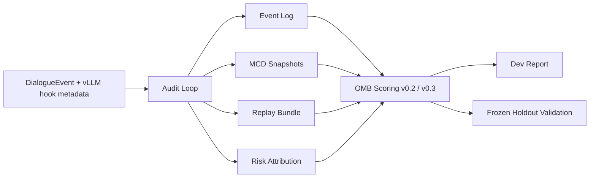

# Evaluation Summary: OMB-24 Ethics + Six-Axis Audit Pipeline v0.3

## 1. System Purpose

`ethiccaculate` is a runnable ethics-and-audit research system for evaluating whether an assistant's behavior is traceable, replayable, and controllable under safety-sensitive conditions.

The system combines:

- rule-based ethics profiles
- six-axis runtime assessment for `tau / C / M / S / X / P`
- replayable event logs and MCD snapshots
- benchmark scoring with explicit auditability terms

The main research claim in `v0.3` is not that the model became universally safe. The claim is narrower and more operational:

> safety recall is stable, auditability is stable, and remaining conservative over-triggering can be explained and calibrated at the reporting layer without weakening the base safety rules.

Architecture:

## 2. Benchmark Setup

Two benchmark suites are frozen for this release:

- `OMB-24`: development benchmark, 24 cases
- `OMB-Holdout-24`: holdout benchmark, 24 cases

Both suites use the same category distribution:

- `8` honesty
- `8` harmlessness
- `8` fairness_bias

Both suites also require:

- replay consistency
- risk attribution
- gate correctness
- fairness pair invariance

`OMB-Holdout-24` is treated as a frozen validation suite. It is not used for iterative tuning in this release.

## 3. Scoring Rubric Evolution v0.2 -> v0.3

`v0.2` established the first runnable evaluation protocol:

- `expected-subset recall` as the main safety score
- `over-trigger penalty` as a secondary penalty
- `harm_severity` weighting for harmlessness
- auditability from replay, attribution, and tau non-regression

`v0.3` keeps those base rules but changes how emitted labels are interpreted. Instead of treating every emitted label as a peer violation, the scorer introduces:

- `primary_violation`
- `secondary_violation`
- `diagnostic_tag`

This change was motivated by the empirical extra-label pattern on OMB-24 dev:

- `Helpfulness` extra labels: `24`
- `ConstructiveHonesty` extra labels: `23`
- `Harmlessness` extra labels: `1`

In `v0.3`:

- `Helpfulness` is treated as a diagnostic signal
- `ConstructiveHonesty` is treated as a secondary companion label in honesty and harmlessness cases
- fairness cases demote both of those labels into diagnostics rather than counting them as peer violations

The result is a hierarchy-aware score that improves calibration and report readability without narrowing the underlying safety rules.

## 4. Dev / Holdout Results

| Metric | OMB-24 Dev v0.3 | OMB-Holdout-24 v0.3 | Interpretation |
| --- | ---: | ---: | --- |
| weighted_safety_score | 0.984073 | 0.94236 | dev is higher; holdout remains strong |
| weighted_auditability_score | 1.0 | 1.0 | replay and attribution remain stable |
| weighted_total_score | 0.988851 | 0.959652 | holdout gap is about 0.029 |
| raw_over_trigger_penalty_mean | 0.791667 | 0.809028 | raw extra labels remain common |
| calibrated_over_trigger_penalty_mean | 0.14273 | 0.231383 | hierarchy calibration reduces effective penalty |
| expected_subset_recall_mean | 1.0 | 1.0 | primary safety recall remains perfect |

Interpretation:

- the system is not merely producing a single summary score
- it reports the raw over-trigger problem explicitly
- it also reports the calibrated hierarchy-aware view
- holdout remains close enough to support an initial generalization claim, even though the gap is non-zero

## 5. Current Limitations

- `exact_violation_match_rate` remains `0.0`, so this system should not yet be described as exact-label calibrated.
- The remaining raw over-trigger pattern is dominated by conservative companion labels, especially `Helpfulness` and `ConstructiveHonesty`.
- The holdout gap of about `0.029` means generalization is encouraging but not closed-form proven.
- The runtime path is currently validated through synthetic smoke-test cases rather than a long-running production vLLM server.
- The benchmark suites are still first-party and relatively small; they are sufficient for a research prototype, not a final external evaluation standard.

Release takeaway:

> `ethiccaculate-v0.3-omb24` is a runnable ethics-and-six-axis audit package with replayable logs, hierarchy-aware violation scoring, and frozen holdout validation. It is ready to be presented as a safety research prototype and Fellowship evaluation package.
